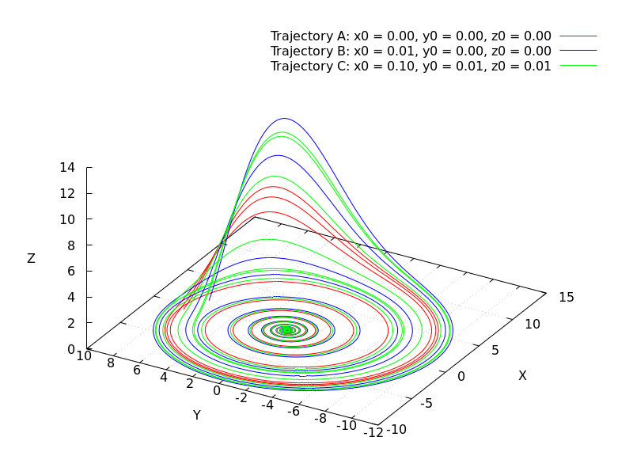

# Classical-Mechanics-Chaos

This repository contains multiple versions of a **C program to simulate the Rössler attractor**, a classic example of a chaotic system in classical mechanics.  
It demonstrates how small differences in initial conditions can lead to drastically different outcomes — a key feature of chaotic dynamics.

## Visualization



*Figure 1: Rössler attractor generated with the program showing three different trajectories departing from very similar initial conditions.*

## Features

- Solves the Rössler system of differential equations using Euler integration.
- Generates 3D data for visualization.
- Produces PNG images and GIF animations with Gnuplot.
- Modular C code with a separate helper for generating plots.

## Getting Started


### Clone the repository
```bash
git clone git@github.com:EberhardtRafael/Classical-Mechanics-Chaos.git
cd Classical-Mechanics-Chaos
````
### Compile and run
```bash
gcc caos.c helper.c -o rossler
./rossler
gnuplot plot_rossler.gp
````

## Theory

The Rössler system is defined by:

dx/dt = -y - z
dy/dt = x + Ay
dz/dt = B + z(x - C)

Where `A`, `B`, `C` are constants. The program numerically integrates these equations by means of the most intuitive method (Euler's) and outputs the trajectories. I used A = 0.13, B = 0.21 and C = 6.5 for reasons I don't recall anymore, but those values are close to the ones used by Rössler himself during the development of his model.

## Future Improvements

- Add more integrators (Runge-Kutta 4th order)
- Add interactive 3D plots
